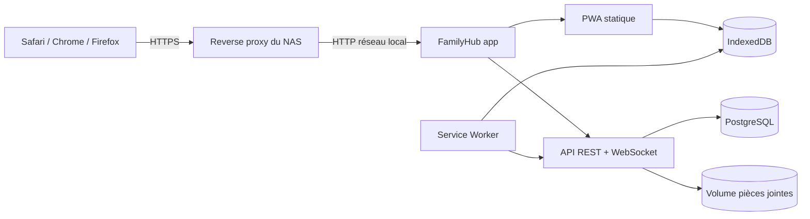

# FamilyHub — Dossier de conception technique

**Statut :** validé le 9 septembre 2026  
**Version :** 0.1  
**Référence fonctionnelle :** `PRD_FamilyHub_PWA.md`

## 1. Décisions directrices

FamilyHub sera un monorepo TypeScript composé de :

- une PWA React construite avec Vite ;
- une API HTTP et WebSocket Fastify ;
- PostgreSQL comme source de vérité ;
- Drizzle ORM pour le schéma typé et les migrations SQL inspectables ;
- IndexedDB côté navigateur pour les données offline et la file de mutations ;
- un stockage de pièces jointes abstrait, sur volume local par défaut et compatible S3 en option ;
- un unique conteneur applicatif de production servant l'API et les fichiers statiques de la PWA.

Le choix d'un frontend et d'une API séparés dans le code, mais réunis dans la même image de
production, garde une séparation nette sans compliquer l'installation sur NAS.

### Pourquoi cette architecture

- Pas de dépendance obligatoire à un cloud ou à un fournisseur d'identité.
- Deux services seulement au démarrage : `app` et `db`.
- WebSocket natif pour le chat et les notifications temps réel.
- Migrations relationnelles explicites pour les permissions et l'intégrité des données.
- Possibilité d'ajouter plus tard un worker séparé sans l'imposer au MVP.

### Ce qui n'est pas retenu au MVP

- Redis : inutile pour une instance mono-processus de petite taille.
- Elasticsearch/Meilisearch : la recherche PostgreSQL suffit initialement.
- MinIO obligatoire : un volume local est plus simple sur NAS.
- Microservices : ils augmenteraient le coût d'exploitation sans bénéfice produit immédiat.

## 2. Architecture d'exécution



En développement, Vite et l'API tournent séparément pour le rechargement à chaud. En
production, Fastify sert le bundle statique et toutes les routes sous `/api/v1` ainsi que
`/ws`. Une route SPA inconnue retourne `index.html`, jamais une route API inconnue.

### Arborescence cible

```text
apps/
  api/                 API, auth, WebSocket, jobs légers
  web/                 PWA React
packages/
  contracts/           schémas d'entrée/sortie et types partagés
  database/            schéma Drizzle et migrations
  domain/              règles métier sans dépendance UI/HTTP
  config/              configuration typée
  ui/                  composants transversaux, dont la visibilité
deploy/
  docker/              image de production et scripts d'entrée
docs/
compose.yaml
.env.example
```

## 3. Frontières et flux

- Le navigateur ne décide jamais d'une autorisation. Il masque des actions pour l'UX,
  tandis que l'API refait chaque contrôle.
- Le domaine contient les règles invariantes : visibilité, occurrences de tâches,
  transitions d'état, votes et conversions.
- L'API ouvre une transaction pour toute mutation touchant plusieurs tables.
- Les événements d'activité et notifications sont écrits dans la même transaction que
  l'objet métier ; leur diffusion WebSocket se fait après validation de la transaction.
- Les tâches asynchrones tolérantes au délai (email, Web Push, métadonnées de bookmark)
  utilisent une table `outbox_job`. Un job runner intégré au processus les exécute. Une
  ligne possède une clé d'idempotence et peut être reprise après redémarrage.

## 4. Modèle de données

Toutes les clés sont des UUID générés côté client ou serveur selon l'objet. Les dates sont
stockées en UTC (`timestamptz`) et rendues dans le fuseau de l'utilisateur. Une table socle
`resource` porte `id`, `instance_id`, `resource_type`, `created_by`, `visibility`,
`created_at`, `updated_at` et `deleted_at`. Chaque table métier partageable référence cette
ligne avec la même clé primaire. Cette structure donne aux ACL de vraies clés étrangères et
évite une association polymorphe impossible à vérifier en base.

### Socle multi-instance et identité

| Table | Rôle et champs structurants |
|---|---|
| `instance` | nom, langue, fuseau par défaut, limites, configuration |
| `user` | email normalisé, hash du mot de passe, prénom, nom, téléphone, naissance, fuseau, statut |
| `instance_member` | rôle `ADMIN`/`MEMBER`, date d'entrée, état, préférences de profil |
| `group` | nom, description, groupe système éventuel |
| `group_membership` | groupe, membre, dates d'effet |
| `invite` | email, rôle, hash du jeton, expiration, auteur, consommation |
| `session` | hash du jeton de session, membre, expiration, révocation, métadonnées limitées |
| `module_config` | clé du module, actif, configuration JSON validée |
| `admin_audit_log` | acteur, action, cible, résumé avant/après, date, adresse IP tronquée |

Même si le premier déploiement ne contient qu'un foyer, `instance_id` évite qu'une future
évolution multi-foyer exige une migration dangereuse des permissions.

### Visibilité transversale

Chaque table partageable possède `visibility` avec l'une des valeurs `PRIVATE`,
`ALL_MEMBERS`, `GROUPS`, `SELECTED_USERS`.

| Table | Rôle |
|---|---|
| `resource` | identité et attributs communs de tout objet partageable |
| `resource_acl_group` | ressource et groupe autorisé, avec clés d'instance cohérentes |
| `resource_acl_user` | ressource et membre autorisé, avec clés d'instance cohérentes |
| `favorite` | favori privé d'un membre vers une ressource visible |
| `tag`, `resource_tag` | taxonomie et association à une ressource |
| `comment` | commentaire rattaché à un objet ; hérite de sa visibilité |
| `attachment` | métadonnées, clé de stockage, MIME détecté, taille, hash, état antivirus éventuel |
| `resource_attachment` | rattachement explicite d'un fichier à sa ressource parente |

Les conversations et messages font exception à la visibilité générique : leur accès est
strictement dérivé de `conversation_member`, conformément au PRD. Les autres tables d'ACL
sont centralisées et référencent une ressource existante de la même instance.

### Modules métier

| Domaine | Tables principales |
|---|---|
| Activité | `activity_event`, `notification`, `notification_preference`, `device_subscription` |
| Chat | `conversation`, `conversation_member`, `message`, `message_reaction` |
| Agenda | `calendar_event`, `event_participant`, `recurrence_rule`, `reminder` |
| Tâches | `task`, `task_occurrence`, `task_completion` |
| Repas | `meal`, `ingredient`, `meal_ingredient`, `meal_preference`, `meal_plan_entry` |
| Courses | `shopping_list`, `shopping_item`, `shopping_item_change` |
| Bookmarks | `bookmark`, `bookmark_reaction` |
| Pages | `page`, `page_revision`, `page_link` |
| Collections | `collection`, `collection_item`, `collection_item_preference` |
| Sondages | `poll`, `poll_option`, `poll_vote` |
| Idées | `idea`, `idea_reaction`, `idea_conversion` |
| Contacts | `contact` |
| Documents | métadonnées dans `document`, fichier via `attachment` |

### Modélisation normative des tâches

`task` contient notamment :

- `kind`: `SCHEDULED`, `OPEN_CHORE`, `SEASONAL` ;
- `status`: `OPEN`, `IN_PROGRESS`, `DONE`, `CANCELLED` ;
- `assignee_id` nullable et `claimable` ;
- `due_at`, `period_start`, `period_end`, tous optionnels et cohérents avec `kind` ;
- `recurrence_rule_id` pour une vraie récurrence temporelle ;
- `indicative_frequency_value/unit` pour une fréquence non planifiée ;
- `reopen_policy`: `NONE`, `MANUAL`, `AFTER_DELAY`, `SCHEDULED` ;
- `reopen_after_seconds` si nécessaire.

`task_occurrence` représente une fenêtre ou échéance concrète, sans créer de
`calendar_event`. L'agenda effectue une union paginée entre événements et projections de
tâches. `task_completion` conserve l'auteur, la date, le commentaire et l'occurrence.

### Contraintes essentielles

- Un membre, groupe ou objet référencé doit appartenir à la même instance.
- Un objet `GROUPS` doit avoir au moins un groupe ACL ; `SELECTED_USERS`, au moins un membre.
- Un vote non multiple est unique par sondage et membre.
- Le vote anonyme garde une clé technique anti-double-vote, inaccessible dans les réponses
  produit ; l'anonymat et ses limites sont annoncés dans l'UI.
- Les messages sont append-only ; une édition crée une trace et une suppression devient un
  tombstone.
- Une pièce jointe n'est visible que via au moins un parent visible.
- Les suppressions sensibles sont logiques avant purge par politique de rétention.

## 5. Authentification et autorisation

### Flux initiaux

1. Au premier démarrage, si aucune instance n'existe, `/setup` permet de créer l'instance
   et son premier administrateur avec un jeton d'initialisation à usage unique.
2. L'administrateur invite ensuite un membre. Seul le hash du jeton d'invitation est stocké.
3. Le membre accepte l'invitation, choisit son mot de passe puis ouvre une session.
4. Le cookie de session est `HttpOnly`, `Secure` hors développement, `SameSite=Lax`, avec
   rotation après authentification et changement de privilège.
5. Les mutations utilisent un jeton CSRF lié à la session. Les endpoints de login,
   invitation, setup, upload et export ont des limites de débit distinctes.

Les mots de passe sont hashés avec Argon2id. Les réponses de login restent identiques pour
un compte absent, désactivé ou un mot de passe faux. Aucun contenu métier n'est accessible
avant authentification.

### Décision d'autorisation

Pour chaque requête, l'API applique dans cet ordre :

1. session valide et membre actif ;
2. module essentiel ou module fonctionnel actif ;
3. permission d'action du rôle ;
4. appartenance de la cible à la même instance ;
5. droit de lecture issu du créateur et de `visibility`/ACL ;
6. droit de modification : créateur, capacité explicitement déléguée ou modération admin ;
7. règle métier spécifique.

Un administrateur peut modérer un objet, mais cela ne l'ajoute jamais aux conversations et
ne lui donne pas une route de lecture ordinaire vers un contenu privé. Une action de
modération exceptionnelle est dédiée, auditée et affiche son motif.

### Recherche et fuites indirectes

La clause d'autorisation fait partie de la requête SQL avant classement, comptage, extrait
ou pagination. L'autocomplete, les notifications, les WebSockets, les exports et les logs
réutilisent le même service de portée. Une ressource existante mais interdite répond comme
une ressource absente, sauf écran administratif explicitement prévu.

## 6. Découpage modulaire

Chaque module expose un manifeste typé : clé, routes web, routes API, types créables,
widgets, événements d'activité, index de recherche et dépendances optionnelles.

| Module | Obligatoire | Dépendances |
|---|---:|---|
| Accueil | oui | consomme les événements des modules actifs |
| Membres/groupes | oui | aucune |
| Notifications | oui | aucune ; canaux enrichis par les modules |
| Recherche | oui | indexeurs des modules actifs |
| Paramètres | oui | aucune |
| Chat | non | pièces jointes transversales |
| Agenda | non | aucune ; reçoit les projections de Tâches |
| Tâches | non | Agenda optionnel pour l'affichage daté |
| Repas | non | Courses optionnel pour l'action d'ajout |
| Courses | non | aucune |
| Pages | non | liens enrichis optionnels vers modules actifs |
| Idées | non | conversions seulement vers modules actifs |
| Autres modules | non | socle transversal uniquement |

Désactiver un module bloque ses routes de navigation, création et mutation. Les données
restent présentes. La lecture directe par URL est bloquée pour les membres ; les exports
administratifs conservent les données. Les jobs et notifications non critiques du module
sont suspendus.

## 7. Routes API principales

Toutes les routes sont versionnées sous `/api/v1`. Les listes utilisent une pagination par
curseur stable. Les entrées et sorties suivent des schémas partagés ; aucune entité ORM
n'est sérialisée directement.

```text
GET    /health/live
GET    /health/ready
POST   /setup
POST   /auth/login
POST   /auth/logout
POST   /auth/refresh
GET    /me

GET    /members                 POST /members/invitations
PATCH  /members/:id             DELETE /members/invitations/:id
GET|POST /groups                PATCH|DELETE /groups/:id
PUT|DELETE /groups/:id/members/:memberId
GET    /modules                 PATCH /modules/:key

GET    /home                    GET /activity
GET    /notifications           PATCH /notifications/:id
GET|PATCH /notification-preferences
GET    /push/config             POST|DELETE /push/subscriptions
GET    /search?q=...

GET|POST /conversations         GET|POST /conversations/:id/messages
PATCH    /conversations/:id/mute
POST     /messages/:id/reactions
GET|POST /events                PATCH /events/:id
PUT      /events/:id/response
GET|POST /tasks                 PATCH /tasks/:id
POST     /tasks/:id/complete    POST /tasks/:id/reopen
GET|POST /meals                 GET|POST /meal-plan
POST     /meals/:id/to-shopping-list
GET|POST /shopping-lists        POST /shopping-lists/:id/items
PATCH    /shopping-items/:id
GET|POST /bookmarks             GET|POST /pages
POST     /pages/:id/revisions/:revisionId/restore
GET|POST /collections           POST /collections/:id/items
GET|POST /polls                 POST /polls/:id/votes
GET|POST /ideas                 POST /ideas/:id/convert
GET|POST /contacts              GET|POST /documents
GET      /exports/:scope        POST /imports/bookmarks

POST /uploads/init              PUT /uploads/:id/content
POST /uploads/:id/complete      GET /attachments/:id/content
POST /sync/push                 GET /sync/pull?cursor=...
POST /exports                   GET /exports/:id
GET  /ws
```

`/sync/push` accepte une liste bornée de mutations contenant `clientMutationId`,
`deviceId`, `entityType`, `entityId`, `baseVersion`, `occurredAt` et l'opération. Le serveur
conserve les identifiants traités afin qu'un rejeu retourne le même résultat.

## 8. Écrans et navigation

### Mobile

La barre basse contient `Accueil`, `Chat`, `Agenda`, `Tâches` et `Plus`. Une destination
désactivée libère sa place mais le nombre total ne dépasse jamais cinq. `Plus` présente les
seuls modules actifs et les réglages. Le bouton `+` ouvre une feuille d'actions filtrée par
modules actifs et permissions.

### Desktop

Une sidebar reprend exactement la hiérarchie mobile. La zone de contenu garde une largeur
adaptée au module : compacte pour les formulaires et fluide pour agenda/chat. La navigation
clavier et les libellés accessibles sont présents dès le socle.

### Premier parcours à livrer

1. Configuration initiale ou connexion.
2. Accueil montrant Aujourd'hui, À voir et une activité agrégée.
3. Gestion des membres, groupes et modules par l'administrateur.
4. Paramètres personnels et notifications.
5. États vide, chargement, erreur, offline et accès interdit cohérents.

Le thème clair, sombre ou système et les modules masqués sont conservés localement par
appareil. Les préférences de notification (niveau, modules silencieux et plage calme) sont
stockées côté serveur. Lorsque VAPID est configuré, un `LISTEN/NOTIFY` PostgreSQL déclenche
la livraison Web Push sans dupliquer cette logique dans chaque module ; une table de
livraison idempotente évite les doublons et les abonnements expirés sont purgés.

Le thème visuel proposé est domestique mais net : bleu nuit pour la structure, accents
turquoise pour l'action et ambre pour ce qui réclame de l'attention. Les surfaces restent
denses et lisibles, sans esthétique de logiciel d'entreprise.

## 9. Offline et synchronisation

IndexedDB contient :

- un cache borné des objets visibles nécessaires aux écrans prioritaires ;
- une file de mutations avec état `PENDING`, `SENDING`, `ACKNOWLEDGED`, `CONFLICT` ;
- un curseur de synchronisation par instance et appareil ;
- uniquement des données appartenant à la session active.

À la déconnexion, le cache privé est effacé. Les pièces jointes ne sont pas mises en cache
par défaut. Le Service Worker ne met jamais en cache les réponses d'authentification ni les
exports.

Les tranches offline prioritaires couvrent Courses et Tâches en écriture, avec rejeu ordonné
des mutations idempotentes. L'agenda et le planning des repas conservent des instantanés
bornés par période et restent consultables en lecture seule sans réseau.

La tranche Courses conserve dans IndexedDB une copie bornée de la liste par couple
instance/membre et une file de mutations idempotentes. L'interface applique immédiatement
les ajouts et changements d'état, indique ce qui reste à synchroniser, puis rejoue la file au
retour du réseau. Une déconnexion efface les données locales privées ; si elle survient hors
ligne, la révocation de la session serveur est finalisée à la reconnexion.

Le même journal couvre la création, la prise en charge, la réalisation, l'annulation et la
réouverture des tâches. Un ordre monotone local préserve les séquences créées dans la même
milliseconde. Une erreur fonctionnelle 4xx devient un conflit explicite ; l'utilisateur peut
recharger la version du serveur, tandis que les erreurs réseau, 429 et 5xx restent à rejouer.

Pour Pages, une mutation avec `baseVersion` obsolète devient un conflit explicite ; le texte
local et distant est conservé. Chat est append-only. Les champs simples de tâches/courses
acceptent last-write-wins côté serveur tout en gardant le journal de synchronisation.

## 10. Plan de migrations

- Une migration SQL immuable et numérotée accompagne chaque changement de schéma.
- L'image exécute un binaire de migration avant de démarrer le serveur, sous verrou
  PostgreSQL pour empêcher deux migrations concurrentes.
- Une migration réussie est enregistrée avec son hash ; un hash modifié provoque un arrêt.
- Les migrations destructives suivent expand/migrate/contract sur plusieurs versions.
- La version applicative refuse de démarrer si la base est plus récente que ce qu'elle sait
  lire.
- Une sauvegarde est recommandée et vérifiée avant toute mise à jour comportant une
  migration non rétrocompatible.

Ordre initial : socle instance/identité, groupes/modules, ACL transversales, fichiers/tags,
activité/notifications, puis tables par phase produit. Les index de recherche et de
synchronisation sont ajoutés avec le module concerné.

## 11. Plan de tests

| Niveau | Couverture attendue |
|---|---|
| Unitaire | règles de visibilité, transitions de tâches, récurrence, agrégation des ingrédients |
| Propriété | matrice rôles/visibilités/groupes et invariants de synchronisation |
| Intégration DB | contraintes multi-instance, transactions, migrations, recherche autorisée |
| API | auth, CSRF, rate limits, validation, idempotence et erreurs non révélatrices |
| Contrat | compatibilité schémas web/API et anciennes mutations offline supportées |
| Composants | formulaires progressifs, sélecteur de visibilité, états vides/offline |
| E2E | parcours d'acceptation du PRD sur mobile et desktop |
| Sécurité | accès horizontal/vertical, upload, XSS WYSIWYG, session, exports |
| PWA | installation, mise à jour du SW, cache cloisonné, reconnexion et conflits |
| Docker | démarrage vierge, redémarrage, upgrade, restauration, amd64 et arm64 |

Chaque correction de fuite de permission reçoit un test de non-régression au niveau service
et API. Les critères d'acceptation globaux du PRD deviennent des scénarios E2E traçables.

## 12. Ordre d'implémentation proposé

1. Initialiser le monorepo, les contrôles qualité et l'image multi-stage.
2. Livrer `compose.yaml`, la configuration typée et les healthchecks.
3. Créer la base, les migrations du socle et le bootstrap sécurisé.
4. Implémenter sessions, membres, groupes, modules et autorisation transversale.
5. Construire la coque PWA, la navigation adaptative et le composant de visibilité.
6. Ajouter accueil, activité, notifications in-app et recherche de base.
7. Poursuivre les phases 2 à 5 du PRD, module par module, avec tests associés.

## 13. Points proposés à valider

- Stack React/Vite + Fastify + PostgreSQL + Drizzle.
- Une seule instance logique créée au premier démarrage, tout en conservant `instance_id`.
- Deux conteneurs obligatoires seulement (`app`, `db`).
- Pièces jointes sur volume local par défaut, S3 optionnel ultérieurement.
- HTTPS confié par défaut au reverse proxy du NAS ; profil Caddy facultatif documenté.
- Pas de Redis, moteur de recherche ou stockage objet supplémentaire au MVP.
- Backups déclenchés explicitement, avec exemples compatibles avec la planification du NAS.
